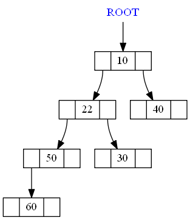

Skew Heap
====================
Building with AppVeyor: 

Building with Travis: 

This repository has a project with the implementation of a Skew Heap.

It is written in C++.

The code of the Skew Heap is independent of platform.

Is has two possible main files:

* [Codes](#markdown-header)
	* [A main that triggers unit test;](#markdown-header-emphasis)

	* [A Qt project to manage the Skew Heap (With Gui).](#markdown-header-strikethrough)
	
The library used to make the Unit Test is the Catch v2.12.3. The code is already in this repository.

The Qt project generates images of the Skew Heap, using the lib Graphviz.
Install this lib in your computer for you to be able to create such images.

The code was written containing the Doxygen documentation.

- - -

You have several options to build the project: 
====================

* [Build tools](#markdown-header)
	* [Makefile (using the file named MakefileGeneral);](#markdown-header-emphasis)
	* [CMake.](#markdown-header-emphasis)
	* [Qt Project (With QMake).](#markdown-header-emphasis)

The project has no leaks (Fully tested with Valgrind).

All the unit tests are ok.

- - -

The functionalities available are: 
====================

* [Functionalities](#markdown-header)
	* [Insert;](#markdown-header-emphasis)
	* [Search;](#markdown-header-emphasis)	
	* [Remove min;](#markdown-header-emphasis)
	* [Merge of two heaps;](#markdown-header-emphasis)
	* [Traverse types:](#markdown-header-emphasis)
		* [Pre-order;](#markdown-header-emphasis)
		* [in-order;](#markdown-header-emphasis)
		* [Pos-order;](#markdown-header-emphasis)
		* [In-level.](#markdown-header-emphasis)
	
- - -

Sample images (type of view 1): 
====================

- - -

Sample images (type of view 2): 
====================

Qt gui project: 
====================
The qt gui application gui is shown below:

Insertion steps (type of view 1): 
====================

## Initial:

## Inserting 50:

## Inserting 22:

## Inserting 30:

## Inserting 10:

## Inserting 40:

## Inserting 60:

## Inserting 70:

## Inserting 80:

## Inserting 90:

## Inserting 100:

## Inserting 110:

Insertion steps (type of view 2): 
====================

## Initial:

## Inserting 50:

## Inserting 22:

## Inserting 30:

## Inserting 10:

## Inserting 40:

## Inserting 60:

## Inserting 70:

## Inserting 80:

## Inserting 90:

## Inserting 100:

## Inserting 110:

Remove min samples (type of view 1): 
====================

## Initial:

## Removing:

## Removing:

## Removing:

## Removing:

## Removing:

Remove min samples (type of view 2): 
====================

## Initial:

## Removing:

## Removing:

## Removing:

## Removing:

## Removing:

